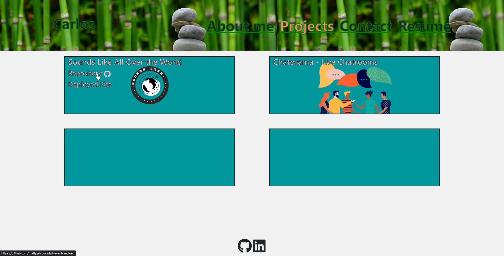

# React Portfolio

## Description

This repository is the home for my portfolio site built entirely with [React](https://reactjs.org/). It is hosted on github pages using the [gh-pages](https://github.com/gitname/react-gh-pages) module. 

Displayed below is the projects page for my site.

You can access the rest of the site by clicking the deployed link below and navigating the site using the nav bar.

## Deployed 

[Live Site](https://carmart7.github.io/react-portfolio/)

## Technologies Used

- [Visual Studio Code](https://code.visualstudio.com/)
- [Github](https://github.com/)
- [Node JS](https://nodejs.org/dist/latest-v16.x/docs/api/)
- [React](https://reactjs.org/)
- [gh-pages](https://github.com/gitname/react-gh-pages)
- [React Icons](https://react-icons.github.io/react-icons/)
- [Bootstrap](https://www.npmjs.com/package/bootstrap)
